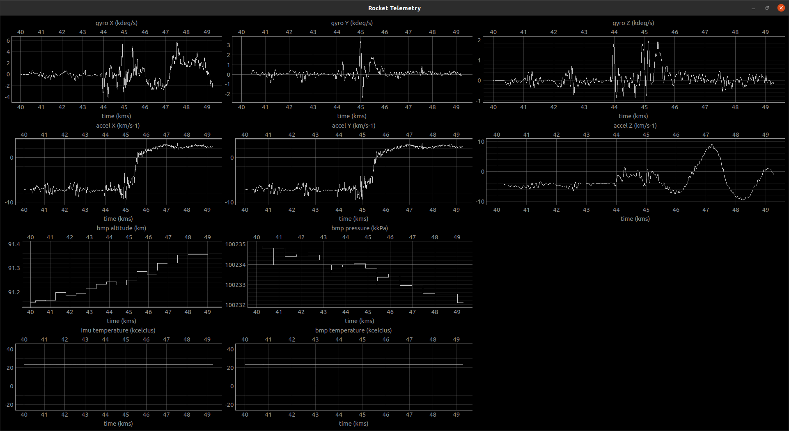

# ESP32RocketTelemetry

ESP32: BMP280 + MPU6050

Connected to a WiFi AP, broadcasting UDP packets with telemetry info: pressure, gyro, accel, temperature

Python3 setup a UDP server, displaying informations in grapth with [PyQtGraph](http://www.pyqtgraph.org/)

[See more images](doc/)
